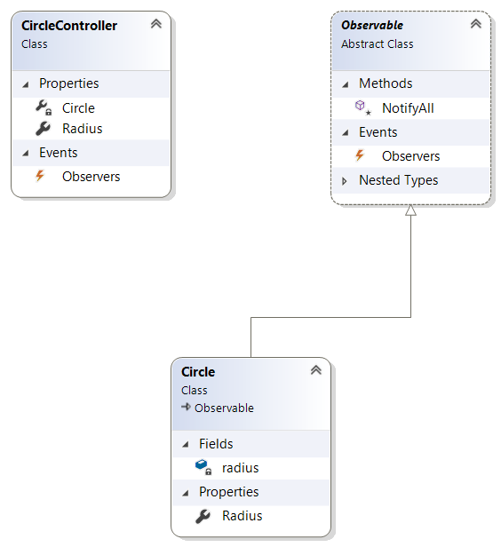

# CircleWpf
Diese Anwendung zeigt die Anwendung des MVC-Patterns mit Wpf.
## MVC
MVC ist ein Pattern mit einem Model, einem Kontroller und beliebig vielen Ansichten.

### Klassendiagramm

* CircleController
* Observable
* Circle 

